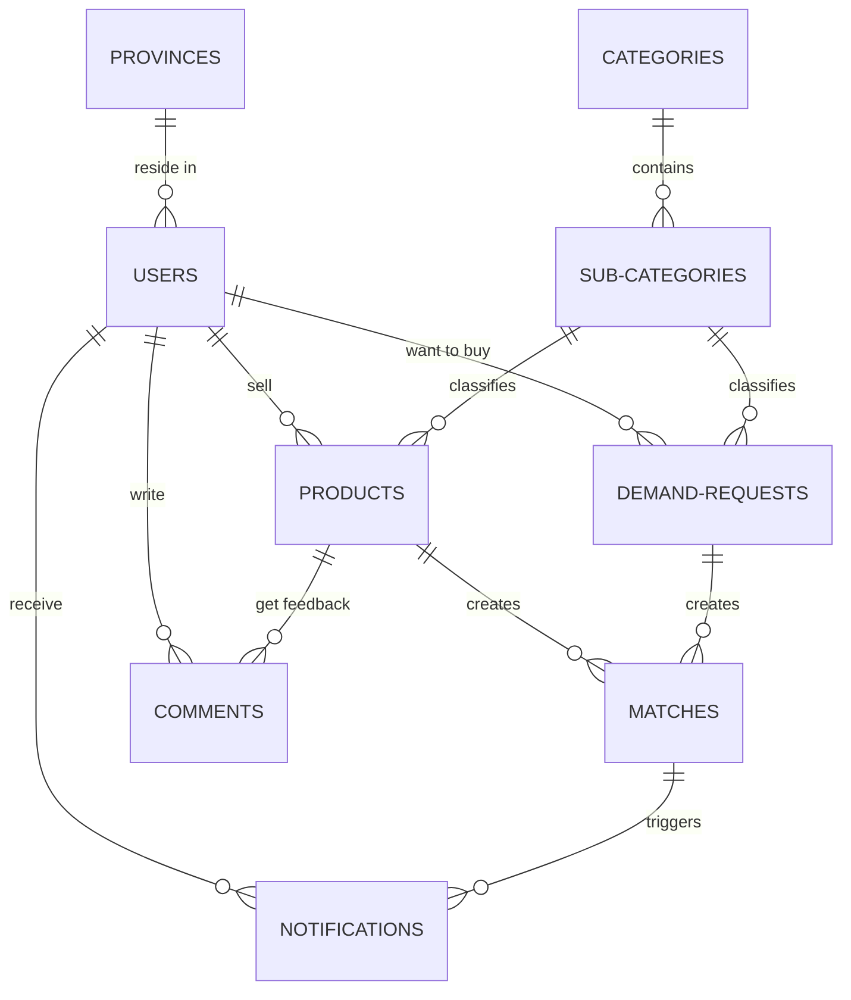

# BaiTorng Database Schema Documentation

This document provides a simple, non-technical explanation of the BaiTorng database schema, an Entity Relationship Diagram (ERD), and the full SQL script used in production.

## 1. How It Works (Non-Technical Explanation)

This database is the "brain" of the **BaiTorng** digital marketplace, connecting farmers and buyers in Cambodia. Think of it as a set of rules and file cabinets that keep the entire business organized.

### The Users (The People)
* **Farmers:** People selling their crops.
* **Buyers:** People looking to purchase products.
* **Middlemen:** People who help move products.
* **Admins:** The staff who manage and keep the platform safe.

### The Marketplace (The Shop)
* **Product Board:** Farmers post what they have for sale (e.g., "I have 500kg of Jasmine Rice").
* **Demand Board:** Buyers post what they are looking for (e.g., "I need 1 ton of Mangoes for $0.50/kg").

### The "Smart Matchmaker" (The Secret Sauce)
Instead of manual searching, the system acts like a matchmaker. When a farmer posts a product, the system instantly looks at all buyer wishlists and calculates a **"Match Score"** based on:
* **Distance:** Are they close? (The system knows which provinces are neighbors).
* **Price:** Is the price what the buyer expects?
* **Quantity:** Does the farmer have enough for the buyer?

If it's a good fit, it automatically sends a **Notification** to both parties so they can start talking.

### Trust and Safety
* **Verification:** Checks if users are who they say they are.
* **Reports:** If someone is acting suspicious, others can report them to the Admins.
* **Admin Logs:** Every important action taken by staff is recorded to ensure everything is done fairly.
* **Listing Limits:** To prevent spam, every user gets a default limit of 10 listings. If they need more, they can request them via `listing_slot_requests`.

---

## 2. Entity Relationship Diagram (ERD)

The following diagram maps out how the different tables connect to each other. Think of it as a neighborhood map showing how information travels.



---

## 3. The Full SQL Schema

Below is the complete, updated SQL code for the `baitorng_final_production.sql` file, which includes the default `listing_limit` of 10 for users.

<details>
<summary>Click here to expand and view the SQL code</summary>

```sql
-- ================================================================
-- BAITORNG — Smart Agriculture Marketplace
-- Database Schema — COMBINED PRODUCTION VERSION (V8.0.0)
-- 2026
-- ================================================================

-- 01. provinces
CREATE TABLE IF NOT EXISTS provinces (
    id       INT AUTO_INCREMENT PRIMARY KEY,
    name_en  VARCHAR(100) NOT NULL UNIQUE,
    name_km  VARCHAR(100),
    region   VARCHAR(50)
);

-- 02. users
CREATE TABLE IF NOT EXISTS users (
    id                  INT AUTO_INCREMENT PRIMARY KEY,
    phone               VARCHAR(20)   NOT NULL UNIQUE,
    password_hash       VARCHAR(255),
    google_id           VARCHAR(255)  UNIQUE,
    facebook_id         VARCHAR(255)  UNIQUE,
    name                VARCHAR(100)  NOT NULL,
    username            VARCHAR(80)   UNIQUE,
    email               VARCHAR(150)  UNIQUE,
    email_verified_at   TIMESTAMP     NULL,
    role                ENUM('farmer','middleman','buyer','admin') NOT NULL,
    province_id         INT           DEFAULT NULL,
    detailed_location   TEXT,
    profile_photo       VARCHAR(255),
    experience          ENUM('lessThan1', '1to3', '3to5', '5to10', 'over10'),
    is_active           BOOLEAN       DEFAULT TRUE,
    is_verified         BOOLEAN       DEFAULT FALSE,
    listing_slot_limit  INT           DEFAULT 10,
    created_at          TIMESTAMP     DEFAULT CURRENT_TIMESTAMP,
    updated_at          TIMESTAMP     DEFAULT CURRENT_TIMESTAMP ON UPDATE CURRENT_TIMESTAMP,
    FOREIGN KEY (province_id) REFERENCES provinces(id) ON DELETE SET NULL
);

-- 03. admins
CREATE TABLE IF NOT EXISTS admins (
    id              INT AUTO_INCREMENT PRIMARY KEY,
    user_id         INT NOT NULL UNIQUE,
    last_active_at  TIMESTAMP,
    created_at      TIMESTAMP DEFAULT CURRENT_TIMESTAMP,
    FOREIGN KEY (user_id) REFERENCES users(id) ON DELETE CASCADE
);

-- 04. admin_sessions
CREATE TABLE IF NOT EXISTS admin_sessions (
    id          INT AUTO_INCREMENT PRIMARY KEY,
    admin_id    INT          NOT NULL,
    token       VARCHAR(512) NOT NULL UNIQUE,
    ip_address  VARCHAR(45)  NOT NULL,
    expires_at  TIMESTAMP    NOT NULL,
    FOREIGN KEY (admin_id) REFERENCES admins(id) ON DELETE CASCADE
);

-- 05. admin_logs
CREATE TABLE IF NOT EXISTS admin_logs (
    id          INT AUTO_INCREMENT PRIMARY KEY,
    admin_id    INT          NOT NULL,
    action      VARCHAR(100) NOT NULL,
    target_type VARCHAR(50),
    target_id   INT,
    created_at  TIMESTAMP    DEFAULT CURRENT_TIMESTAMP,
    FOREIGN KEY (admin_id) REFERENCES admins(id) ON DELETE CASCADE
);

-- 06. sessions
CREATE TABLE IF NOT EXISTS sessions (
    id          INT AUTO_INCREMENT PRIMARY KEY,
    user_id     INT          NOT NULL,
    token       VARCHAR(512) NOT NULL UNIQUE,
    expires_at  TIMESTAMP    NOT NULL,
    created_at  TIMESTAMP    DEFAULT CURRENT_TIMESTAMP,
    FOREIGN KEY (user_id) REFERENCES users(id) ON DELETE CASCADE
);

-- 07. categories
CREATE TABLE IF NOT EXISTS categories (
    id          INT AUTO_INCREMENT PRIMARY KEY,
    name_en     VARCHAR(100) NOT NULL,
    name_km     VARCHAR(100),
    slug        VARCHAR(100) NOT NULL UNIQUE,
    icon        VARCHAR(50)
);

-- 08. sub_categories
CREATE TABLE IF NOT EXISTS sub_categories (
    id          INT AUTO_INCREMENT PRIMARY KEY,
    category_id INT NOT NULL,
    name_en     VARCHAR(100) NOT NULL,
    name_km     VARCHAR(100),
    slug        VARCHAR(100) NOT NULL UNIQUE,
    icon        VARCHAR(50),
    FOREIGN KEY (category_id) REFERENCES categories(id) ON DELETE CASCADE
);

-- 09. products
CREATE TABLE IF NOT EXISTS products (
    id              INT            NOT NULL AUTO_INCREMENT PRIMARY KEY,
    seller_id       INT            NOT NULL,
    sub_category_id INT            NOT NULL,
    variety         VARCHAR(150)   NOT NULL,
    price_per_unit  DECIMAL(10,2)  NOT NULL,
    unit            VARCHAR(30)    NOT NULL DEFAULT 'kg',
    quantity        DECIMAL(10,2)  NOT NULL,
    province_id     INT            NOT NULL,
    description     TEXT,
    is_active       BOOLEAN        DEFAULT TRUE,
    is_featured     BOOLEAN        DEFAULT FALSE,
    created_at      TIMESTAMP      DEFAULT CURRENT_TIMESTAMP,
    updated_at      TIMESTAMP      DEFAULT CURRENT_TIMESTAMP ON UPDATE CURRENT_TIMESTAMP,
    FOREIGN KEY (seller_id) REFERENCES users(id) ON DELETE CASCADE,
    FOREIGN KEY (sub_category_id) REFERENCES sub_categories(id),
    FOREIGN KEY (province_id) REFERENCES provinces(id)
);

-- 10. product_images
CREATE TABLE IF NOT EXISTS product_images (
    id              INT AUTO_INCREMENT PRIMARY KEY,
    product_id      INT NOT NULL,
    image_url       VARCHAR(255) NOT NULL,
    sort_order      TINYINT DEFAULT 0,
    FOREIGN KEY (product_id) REFERENCES products(id) ON DELETE CASCADE
);

-- 11. demand_requests
CREATE TABLE IF NOT EXISTS demand_requests (
    id              INT AUTO_INCREMENT PRIMARY KEY,
    buyer_id        INT            NOT NULL,
    sub_category_id INT            NOT NULL,
    variety         VARCHAR(150)   NOT NULL,
    target_price    DECIMAL(10,2),
    unit            VARCHAR(30)    NOT NULL DEFAULT 'kg',
    quantity_needed DECIMAL(10,2)  NOT NULL,
    province_id     INT            NOT NULL,
    description     TEXT,
    is_active       BOOLEAN        DEFAULT TRUE,
    is_featured     BOOLEAN        DEFAULT FALSE,
    created_at      TIMESTAMP      DEFAULT CURRENT_TIMESTAMP,
    updated_at      TIMESTAMP      DEFAULT CURRENT_TIMESTAMP ON UPDATE CURRENT_TIMESTAMP,
    FOREIGN KEY (buyer_id) REFERENCES users(id) ON DELETE CASCADE,
    FOREIGN KEY (sub_category_id) REFERENCES sub_categories(id),
    FOREIGN KEY (province_id) REFERENCES provinces(id)
);

-- 12. matches
CREATE TABLE IF NOT EXISTS matches (
    id               INT  NOT NULL AUTO_INCREMENT PRIMARY KEY,
    product_id       INT  NOT NULL,
    demand_id        INT  NOT NULL,
    match_score      INT DEFAULT 0,
    province_match   ENUM('same', 'nearby', 'different') NOT NULL,
    status           ENUM('pending', 'contacted', 'completed', 'expired') DEFAULT 'pending',
    seller_notified  BOOLEAN DEFAULT FALSE,
    buyer_notified   BOOLEAN DEFAULT FALSE,
    seller_dismissed BOOLEAN DEFAULT FALSE,
    buyer_dismissed  BOOLEAN DEFAULT FALSE,
    created_at       TIMESTAMP DEFAULT CURRENT_TIMESTAMP,
    expires_at       TIMESTAMP NULL,
    FOREIGN KEY (product_id) REFERENCES products(id) ON DELETE CASCADE,
    FOREIGN KEY (demand_id)  REFERENCES demand_requests(id) ON DELETE CASCADE,
    UNIQUE KEY unique_match (product_id, demand_id)
);

-- 13. notifications
CREATE TABLE IF NOT EXISTS notifications (
    id         INT  NOT NULL AUTO_INCREMENT PRIMARY KEY,
    user_id    INT  NOT NULL,
    match_id   INT,
    type       ENUM('new_match','demand_near_you','product_near_you','system') NOT NULL,
    message    TEXT NOT NULL,
    is_read    BOOLEAN DEFAULT FALSE,
    created_at TIMESTAMP DEFAULT CURRENT_TIMESTAMP,
    FOREIGN KEY (user_id) REFERENCES users(id) ON DELETE CASCADE,
    FOREIGN KEY (match_id) REFERENCES matches(id) ON DELETE SET NULL
);

-- 14. follows
CREATE TABLE IF NOT EXISTS follows (
    id           INT NOT NULL AUTO_INCREMENT PRIMARY KEY,
    follower_id  INT NOT NULL,
    following_id INT NOT NULL,
    created_at   TIMESTAMP DEFAULT CURRENT_TIMESTAMP,
    FOREIGN KEY (follower_id) REFERENCES users(id) ON DELETE CASCADE,
    FOREIGN KEY (following_id) REFERENCES users(id) ON DELETE CASCADE,
    UNIQUE KEY (follower_id, following_id)
);

-- 15. saved_posts (formerly favorites)
CREATE TABLE IF NOT EXISTS saved_posts (
    id          INT NOT NULL AUTO_INCREMENT PRIMARY KEY,
    user_id     INT NOT NULL,
    target_type ENUM('product','demand') NOT NULL,
    target_id   INT NOT NULL,
    created_at  TIMESTAMP DEFAULT CURRENT_TIMESTAMP,
    FOREIGN KEY (user_id) REFERENCES users(id) ON DELETE CASCADE
);

-- 16. comments
CREATE TABLE IF NOT EXISTS comments (
    id         INT NOT NULL AUTO_INCREMENT PRIMARY KEY,
    author_id  INT NOT NULL,
    product_id INT,
    demand_id  INT,
    content    TEXT NOT NULL,
    created_at TIMESTAMP DEFAULT CURRENT_TIMESTAMP,
    FOREIGN KEY (author_id) REFERENCES users(id) ON DELETE CASCADE,
    FOREIGN KEY (product_id) REFERENCES products(id) ON DELETE CASCADE,
    FOREIGN KEY (demand_id) REFERENCES demand_requests(id) ON DELETE CASCADE
);

-- 17. product_views
CREATE TABLE IF NOT EXISTS product_views (
    id         INT NOT NULL AUTO_INCREMENT PRIMARY KEY,
    product_id INT NOT NULL,
    viewer_id  INT,
    ip_address VARCHAR(45),
    viewed_at  TIMESTAMP DEFAULT CURRENT_TIMESTAMP,
    FOREIGN KEY (product_id) REFERENCES products(id) ON DELETE CASCADE,
    FOREIGN KEY (viewer_id) REFERENCES users(id) ON DELETE SET NULL
);

-- 18. listing_slot_requests
CREATE TABLE IF NOT EXISTS listing_slot_requests (
    id              INT NOT NULL AUTO_INCREMENT PRIMARY KEY,
    user_id         INT NOT NULL,
    requested_limit INT NOT NULL,
    status          ENUM('pending','approved','rejected') DEFAULT 'pending',
    reviewed_by     INT,
    created_at      TIMESTAMP DEFAULT CURRENT_TIMESTAMP,
    FOREIGN KEY (user_id) REFERENCES users(id) ON DELETE CASCADE,
    FOREIGN KEY (reviewed_by) REFERENCES users(id) ON DELETE SET NULL
);

-- 19. reports
CREATE TABLE IF NOT EXISTS reports (
    id          INT NOT NULL AUTO_INCREMENT PRIMARY KEY,
    reporter_id INT NOT NULL,
    target_type ENUM('product','demand','user') NOT NULL,
    target_id   INT NOT NULL,
    reason      VARCHAR(255) NOT NULL,
    status      ENUM('open','reviewed','resolved') DEFAULT 'open',
    created_at  TIMESTAMP DEFAULT CURRENT_TIMESTAMP,
    FOREIGN KEY (reporter_id) REFERENCES users(id) ON DELETE CASCADE
);

-- 20. social_links
CREATE TABLE IF NOT EXISTS social_links (
    id         INT AUTO_INCREMENT PRIMARY KEY,
    user_id    INT NOT NULL,
    platform   VARCHAR(50) NOT NULL,
    url        VARCHAR(500) NOT NULL,
    FOREIGN KEY (user_id) REFERENCES users(id) ON DELETE CASCADE
);

-- 21. user_phones
CREATE TABLE IF NOT EXISTS user_phones (
    id           INT AUTO_INCREMENT PRIMARY KEY,
    user_id      INT NOT NULL,
    phone_number VARCHAR(20) NOT NULL,
    label        VARCHAR(50),
    FOREIGN KEY (user_id) REFERENCES users(id) ON DELETE CASCADE
);

-- 22. province_adjacency
CREATE TABLE IF NOT EXISTS province_adjacency (
    province_id INT NOT NULL,
    adjacent_id INT NOT NULL,
    distance_km  INT NOT NULL,
    PRIMARY KEY (province_id, adjacent_id),
    FOREIGN KEY (province_id) REFERENCES provinces(id),
    FOREIGN KEY (adjacent_id) REFERENCES provinces(id)
);

-- 23. legal_documents
CREATE TABLE IF NOT EXISTS legal_documents (
  id INT PRIMARY KEY AUTO_INCREMENT,
  type ENUM ('terms_conditions', 'privacy_policy') NOT NULL,
  title VARCHAR(255) NOT NULL,
  content LONGTEXT NOT NULL,
  version VARCHAR(20) NOT NULL,
  is_active BOOLEAN DEFAULT true,
  created_at TIMESTAMP DEFAULT CURRENT_TIMESTAMP,
  updated_at TIMESTAMP DEFAULT CURRENT_TIMESTAMP ON UPDATE CURRENT_TIMESTAMP
);

-- 24. user_legal_acceptances
CREATE TABLE IF NOT EXISTS user_legal_acceptances (
  id INT PRIMARY KEY AUTO_INCREMENT,
  user_id INT NOT NULL,
  legal_document_id INT NOT NULL,
  accepted_at TIMESTAMP DEFAULT CURRENT_TIMESTAMP,
  FOREIGN KEY (user_id) REFERENCES users(id) ON DELETE CASCADE,
  FOREIGN KEY (legal_document_id) REFERENCES legal_documents(id) ON DELETE CASCADE,
  UNIQUE KEY unique_user_legal_acceptance (user_id, legal_document_id)
);

-- 25. subscription_plans
CREATE TABLE IF NOT EXISTS subscription_plans (
    id                 INT AUTO_INCREMENT PRIMARY KEY,
    name               VARCHAR(50) NOT NULL UNIQUE, -- e.g., 'Basic', 'Pro', 'Premium'
    price              DECIMAL(10,2) NOT NULL,      -- e.g., 0.00, 5.00, 15.00
    duration_days      INT NOT NULL,                -- e.g., 30 for monthly, 365 for yearly
    listing_slot_limit INT NOT NULL,                -- How many slots they get (e.g., 10, 50, 999)              
    description        TEXT,
    is_active          BOOLEAN DEFAULT TRUE,
    created_at         TIMESTAMP DEFAULT CURRENT_TIMESTAMP
);

-- 26. user_subscriptions
CREATE TABLE IF NOT EXISTS user_subscriptions (
    id                 INT AUTO_INCREMENT PRIMARY KEY,
    user_id            INT NOT NULL,
    plan_id            INT NOT NULL,
    start_date         TIMESTAMP NOT NULL,
    end_date           TIMESTAMP NOT NULL,
    status             ENUM('active', 'expired', 'cancelled') DEFAULT 'active',
    created_at         TIMESTAMP DEFAULT CURRENT_TIMESTAMP,
    updated_at         TIMESTAMP DEFAULT CURRENT_TIMESTAMP ON UPDATE CURRENT_TIMESTAMP,
    FOREIGN KEY (user_id) REFERENCES users(id) ON DELETE CASCADE,
    FOREIGN KEY (plan_id) REFERENCES subscription_plans(id) ON DELETE RESTRICT
);

-- 27. payments
CREATE TABLE IF NOT EXISTS payments (
    id                 INT AUTO_INCREMENT PRIMARY KEY,
    user_id            INT NOT NULL,
    subscription_id    INT NOT NULL,
    amount             DECIMAL(10,2) NOT NULL,
    currency           VARCHAR(10) DEFAULT 'USD',    -- Currency code (e.g., USD, KHR)
    payment_method     VARCHAR(50),                  -- e.g., 'ABA Pay', 'Stripe', 'Cash'
    transaction_ref    VARCHAR(255) UNIQUE,          -- Reference ID from the payment gateway (e.g. Stripe Session ID)
    stripe_payment_intent_id VARCHAR(255) UNIQUE,    -- Specific ID for Stripe payment intent
    stripe_customer_id VARCHAR(255),                 -- Stripe customer identifier
    receipt_url        VARCHAR(500),                 -- URL to the payment receipt
    status             ENUM('pending', 'completed', 'failed', 'refunded') DEFAULT 'pending',
    created_at         TIMESTAMP DEFAULT CURRENT_TIMESTAMP,
    updated_at         TIMESTAMP DEFAULT CURRENT_TIMESTAMP ON UPDATE CURRENT_TIMESTAMP,
    FOREIGN KEY (user_id) REFERENCES users(id) ON DELETE CASCADE,
    FOREIGN KEY (subscription_id) REFERENCES user_subscriptions(id) ON DELETE RESTRICT
);


-- TRIGGERS
DELIMITER //
CREATE TRIGGER tr_match_on_product_insert AFTER INSERT ON products FOR EACH ROW
BEGIN
    INSERT IGNORE INTO matches (product_id, demand_id, province_match, match_score, expires_at)
    SELECT 
        NEW.id, 
        d.id,
        IF(d.province_id = NEW.province_id, 'same', IF(adj.distance_km IS NOT NULL, 'nearby', 'different')),
        CAST((
            -- 1. Location Score (Max 50)
            IF(d.province_id = NEW.province_id, 50, 
               IFNULL(GREATEST(0, 50 * (1 - (adj.distance_km / 300))), 0)
            ) +
            -- 2. Criteria Match (Max 50) - Only if units match
            IF(NEW.unit = d.unit, 
               (
                    -- Price Score (Max 30)
                    IF(NEW.price_per_unit <= d.target_price, 30, 30 * (d.target_price / NEW.price_per_unit)) +
                    -- Quantity Score (Max 20)
                    IF(NEW.quantity >= d.quantity_needed, 20, 20 * (NEW.quantity / d.quantity_needed))
               ),
               0
            )
        ) AS UNSIGNED),
        DATE_ADD(CURRENT_TIMESTAMP, INTERVAL 3 DAY)
    FROM demand_requests d 
    LEFT JOIN province_adjacency adj ON (adj.province_id = NEW.province_id AND adj.adjacent_id = d.province_id)
    WHERE d.sub_category_id = NEW.sub_category_id 
      AND d.is_active = TRUE 
      AND d.updated_at >= DATE_SUB(CURRENT_TIMESTAMP, INTERVAL 3 DAY);
END //

CREATE TRIGGER tr_match_on_product_update AFTER UPDATE ON products FOR EACH ROW
BEGIN
    IF NEW.updated_at > OLD.updated_at AND NEW.is_active = TRUE THEN
        INSERT IGNORE INTO matches (product_id, demand_id, province_match, match_score, expires_at)
        SELECT 
            NEW.id, 
            d.id,
            IF(d.province_id = NEW.province_id, 'same', IF(adj.distance_km IS NOT NULL, 'nearby', 'different')),
            CAST((
                IF(d.province_id = NEW.province_id, 50, IFNULL(GREATEST(0, 50 * (1 - (adj.distance_km / 300))), 0)) +
                IF(NEW.unit = d.unit, (IF(NEW.price_per_unit <= d.target_price, 30, 30 * (d.target_price / NEW.price_per_unit)) + IF(NEW.quantity >= d.quantity_needed, 20, 20 * (NEW.quantity / d.quantity_needed))), 0)
            ) AS UNSIGNED),
            DATE_ADD(CURRENT_TIMESTAMP, INTERVAL 3 DAY)
        FROM demand_requests d 
        LEFT JOIN province_adjacency adj ON (adj.province_id = NEW.province_id AND adj.adjacent_id = d.province_id)
        WHERE d.sub_category_id = NEW.sub_category_id 
          AND d.is_active = TRUE 
          AND d.updated_at >= DATE_SUB(CURRENT_TIMESTAMP, INTERVAL 3 DAY);
    END IF;
END //

CREATE TRIGGER tr_match_on_demand_insert AFTER INSERT ON demand_requests FOR EACH ROW
BEGIN
    INSERT IGNORE INTO matches (product_id, demand_id, province_match, match_score, expires_at)
    SELECT 
        p.id, 
        NEW.id,
        IF(p.province_id = NEW.province_id, 'same', IF(adj.distance_km IS NOT NULL, 'nearby', 'different')),
        CAST((
            -- 1. Location Score (Max 50)
            IF(p.province_id = NEW.province_id, 50, 
               IFNULL(GREATEST(0, 50 * (1 - (adj.distance_km / 300))), 0)
            ) +
            -- 2. Criteria Match (Max 50) - Only if units match
            IF(p.unit = NEW.unit, 
               (
                    -- Price Score (Max 30)
                    IF(p.price_per_unit <= NEW.target_price, 30, 30 * (NEW.target_price / p.price_per_unit)) +
                    -- Quantity Score (Max 20)
                    IF(p.quantity >= NEW.quantity_needed, 20, 20 * (p.quantity / NEW.quantity_needed))
               ),
               0
            )
        ) AS UNSIGNED),
        DATE_ADD(CURRENT_TIMESTAMP, INTERVAL 3 DAY)
    FROM products p 
    LEFT JOIN province_adjacency adj ON (adj.province_id = NEW.province_id AND adj.adjacent_id = p.province_id)
    WHERE p.sub_category_id = NEW.sub_category_id 
      AND p.is_active = TRUE 
      AND p.updated_at >= DATE_SUB(CURRENT_TIMESTAMP, INTERVAL 3 DAY);
END //

CREATE TRIGGER tr_match_on_demand_update AFTER UPDATE ON demand_requests FOR EACH ROW
BEGIN
    IF NEW.updated_at > OLD.updated_at AND NEW.is_active = TRUE THEN
        INSERT IGNORE INTO matches (product_id, demand_id, province_match, match_score, expires_at)
        SELECT 
            p.id, 
            NEW.id,
            IF(p.province_id = NEW.province_id, 'same', IF(adj.distance_km IS NOT NULL, 'nearby', 'different')),
            CAST((
                IF(p.province_id = NEW.province_id, 50, IFNULL(GREATEST(0, 50 * (1 - (adj.distance_km / 300))), 0)) +
                IF(p.unit = NEW.unit, (IF(p.price_per_unit <= NEW.target_price, 30, 30 * (NEW.target_price / p.price_per_unit)) + IF(p.quantity >= NEW.quantity_needed, 20, 20 * (p.quantity / NEW.quantity_needed))), 0)
            ) AS UNSIGNED),
            DATE_ADD(CURRENT_TIMESTAMP, INTERVAL 3 DAY)
        FROM products p 
        LEFT JOIN province_adjacency adj ON (adj.province_id = NEW.province_id AND adj.adjacent_id = p.province_id)
        WHERE p.sub_category_id = NEW.sub_category_id 
          AND p.is_active = TRUE 
          AND p.updated_at >= DATE_SUB(CURRENT_TIMESTAMP, INTERVAL 3 DAY);
    END IF;
END //
DELIMITER ;

-- SEEDING
INSERT IGNORE INTO provinces (id, name_en, name_km, region) VALUES 
(1,'Phnom Penh','ភ្នំពេញ','Central'),
(2,'Kandal','កណ្តាល','Central'),
(3,'Takeo','តាកែវ','Southern'),
(4,'Kampong Speu','កំពង់ស្ពឺ','Central'),
(5,'Kampong Chhnang','កំពង់ឆ្នាំង','Central'),
(6,'Pursat','ពោធិ៍សាត់','Western'),
(7,'Battambang','បាត់ដំបង','Western'),
(8,'Banteay Meanchey','បន្ទាយមានជ័យ','Northwestern'),
(9,'Siem Reap','សៀមរាប','Northwestern'),
(10,'Oddar Meanchey','ឧត្តរមានជ័យ','Northwestern'),
(11,'Preah Vihear','ព្រះវិហារ','Northern'),
(12,'Kampong Thom','កំពង់ធំ','Central'),
(13,'Kampong Cham','កំពង់ចាម','Central'),
(14,'Tbong Khmum','ត្បូងឃ្មុំ','Eastern'),
(15,'Prey Veng','ព្រៃវែង','Eastern'),
(16,'Svay Rieng','ស្វាយរៀង','Eastern'),
(17,'Kratie','ក្រចេះ','Northeastern'),
(18,'Stung Treng','ស្ទឹងត្រែង','Northeastern'),
(19,'Ratanakiri','រតនគិរី','Northeastern'),
(20,'Mondulkiri','មណ្ឌលគិរី','Northeastern'),
(21,'Kampot','កំពត','Coastal'),
(22,'Kep','កែប','Coastal'),
(23,'Preah Sihanouk','ព្រះសីហនុ','Coastal'),
(24,'Koh Kong','កោះកុង','Coastal'),
(25,'Pailin','ប៉ៃលិន','Western');

INSERT IGNORE INTO categories (id, name_en, name_km, slug) VALUES (1,'Crop','ដំណាំ','crop'), (2,'Fruit','ផ្លែឈើ','fruit');
INSERT IGNORE INTO sub_categories (category_id, name_en, name_km, slug) VALUES (1,'Rice','អង្ករ','rice'), (2,'Mango','ស្វាយ','mango');

-- PROVINCE ADJACENCY DATA (Top 10 Neighbors each)
INSERT IGNORE INTO province_adjacency (province_id, adjacent_id, distance_km) VALUES
(1, 2, 11), (1, 4, 48), (1, 3, 78), (1, 15, 90), (1, 5, 91), (1, 16, 122), (1, 13, 124), (1, 21, 148), (1, 12, 168), (1, 22, 174),
(2, 1, 11), (2, 3, 55), (2, 15, 65), (2, 4, 72), (2, 13, 85), (2, 5, 115), (2, 16, 115), (2, 14, 125), (2, 21, 140), (2, 12, 150),
(3, 2, 55), (3, 1, 78), (3, 21, 82), (3, 4, 88), (3, 22, 90), (3, 15, 110), (3, 5, 140), (3, 16, 150), (3, 13, 160), (3, 23, 190),
(4, 1, 48), (4, 2, 72), (4, 3, 88), (4, 5, 95), (4, 24, 120), (4, 21, 130), (4, 6, 145), (4, 15, 160), (4, 22, 180), (4, 23, 180),
(5, 6, 70), (5, 1, 91), (5, 4, 95), (5, 12, 105), (5, 2, 115), (5, 13, 140), (5, 3, 150), (5, 15, 160), (5, 9, 180), (5, 7, 200),
(6, 5, 70), (6, 7, 85), (6, 24, 110), (6, 9, 125), (6, 12, 140), (6, 4, 150), (6, 25, 160), (6, 1, 189), (6, 8, 210), (6, 2, 220),
(7, 8, 65), (7, 25, 70), (7, 6, 85), (7, 9, 105), (7, 10, 120), (7, 5, 180), (7, 12, 210), (7, 11, 250), (7, 24, 280), (7, 1, 291),
(8, 7, 65), (8, 10, 75), (8, 9, 95), (8, 25, 120), (8, 12, 160), (8, 11, 190), (8, 6, 210), (8, 5, 250), (8, 24, 320), (8, 1, 359),
(9, 8, 95), (9, 7, 105), (9, 10, 115), (9, 12, 125), (9, 6, 125), (9, 11, 170), (9, 5, 200), (9, 13, 240), (9, 18, 280), (9, 17, 300),
(10, 8, 75), (10, 9, 115), (10, 7, 120), (10, 11, 135), (10, 12, 190), (10, 6, 240), (10, 25, 260), (10, 18, 300), (10, 17, 350), (10, 13, 400),
(11, 10, 135), (11, 12, 150), (11, 9, 170), (11, 18, 180), (11, 17, 210), (11, 19, 280), (11, 20, 320), (11, 8, 330), (11, 13, 350), (11, 14, 380),
(12, 5, 105), (12, 9, 125), (12, 6, 140), (12, 11, 150), (12, 13, 155), (12, 1, 167), (12, 17, 190), (12, 18, 260), (12, 8, 280), (12, 7, 300),
(13, 14, 45), (13, 2, 85), (13, 15, 90), (13, 1, 124), (13, 12, 155), (13, 17, 160), (13, 5, 180), (13, 16, 190), (13, 3, 210), (13, 20, 280),
(14, 13, 45), (14, 15, 95), (14, 17, 120), (14, 16, 135), (14, 2, 145), (14, 20, 220), (14, 1, 230), (14, 3, 250), (14, 18, 280), (14, 12, 300),
(15, 2, 65), (15, 16, 65), (15, 13, 90), (15, 1, 90), (15, 14, 95), (15, 3, 110), (15, 21, 210), (15, 22, 220), (15, 17, 240), (15, 4, 250),
(16, 15, 65), (16, 1, 122), (16, 14, 135), (16, 2, 145), (16, 3, 150), (16, 13, 190), (16, 17, 250), (16, 20, 280), (16, 21, 290), (16, 22, 300),
(17, 18, 110), (17, 14, 120), (17, 13, 160), (17, 20, 175), (17, 12, 190), (17, 11, 210), (17, 19, 250), (17, 9, 300), (17, 1, 315), (17, 2, 325),
(18, 17, 110), (18, 11, 180), (18, 19, 190), (18, 20, 220), (18, 12, 260), (18, 9, 280), (18, 14, 320), (18, 13, 350), (18, 10, 400), (18, 1, 455),
(19, 20, 160), (19, 18, 190), (19, 17, 250), (19, 11, 320), (19, 12, 350), (19, 9, 400), (19, 14, 420), (19, 13, 450), (19, 1, 588), (19, 2, 600),
(20, 19, 160), (20, 17, 175), (20, 18, 220), (20, 14, 260), (20, 13, 280), (20, 15, 320), (20, 16, 340), (20, 20, 360), (20, 1, 521), (20, 2, 530),
(21, 22, 25), (21, 3, 82), (21, 23, 95), (21, 1, 148), (21, 24, 150), (21, 4, 165), (21, 2, 170), (21, 15, 210), (21, 16, 250), (21, 5, 280),
(22, 21, 25), (22, 3, 90), (22, 23, 110), (22, 1, 174), (22, 4, 180), (22, 2, 200), (22, 24, 220), (22, 15, 230), (22, 16, 260), (22, 5, 300),
(23, 21, 95), (23, 22, 110), (23, 24, 115), (23, 4, 180), (23, 3, 190), (23, 1, 230), (23, 2, 240), (23, 6, 280), (23, 7, 320), (23, 25, 350),
(24, 6, 110), (24, 23, 115), (24, 4, 120), (24, 21, 150), (24, 7, 200), (24, 3, 220), (24, 1, 271), (24, 22, 280), (24, 2, 290), (24, 25, 300),
(25, 7, 70), (25, 8, 120), (25, 6, 140), (25, 9, 170), (25, 10, 190), (25, 12, 250), (25, 11, 300), (25, 24, 320), (25, 23, 350), (25, 5, 380);

-- SUBSCRIPTION PLANS SEEDING
INSERT IGNORE INTO subscription_plans (name, price, duration_days, listing_slot_limit, description) VALUES
('Free', 0.00, 36500, 10, 'Basic free tier with standard limits'),
('Plus', 5.00, 30, 50, 'Enhanced tier with 50 slots for active sellers'),
('Pro', 15.00, 30, 999, 'Professional tier with unlimited slots (999) for heavy sellers');

```
</details>
